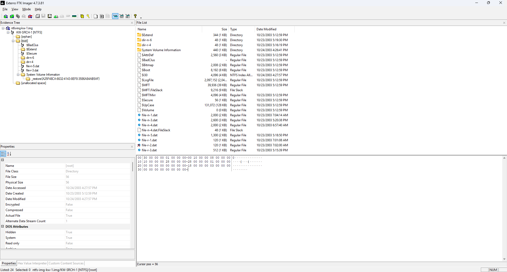
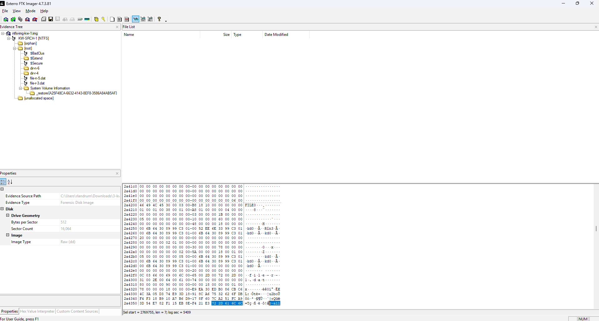
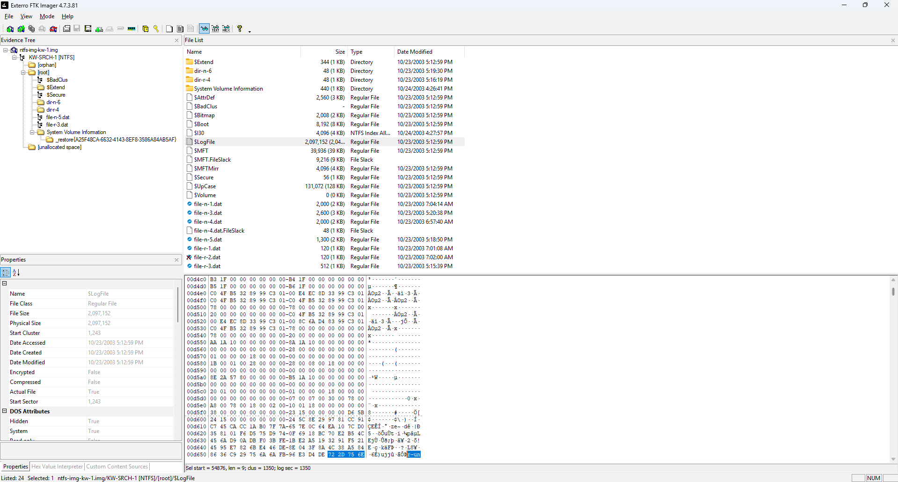
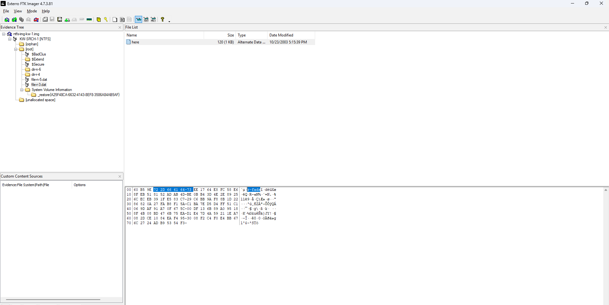
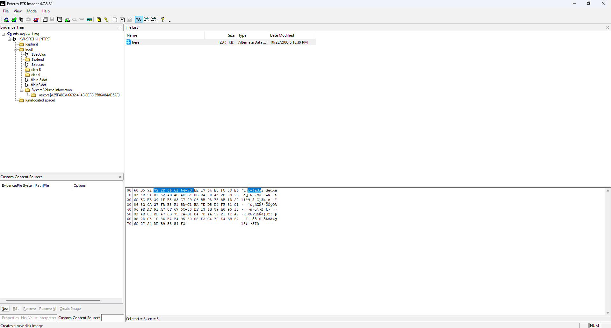
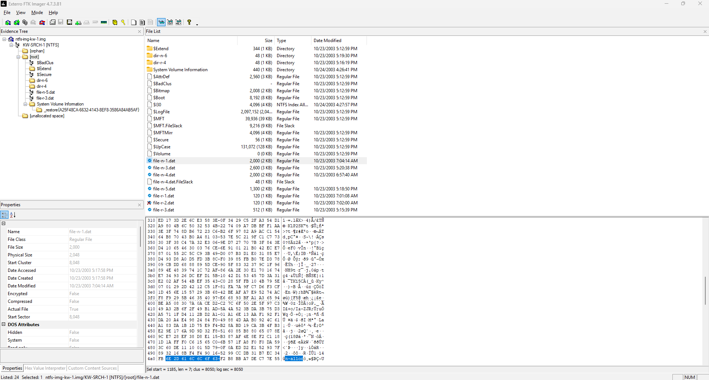
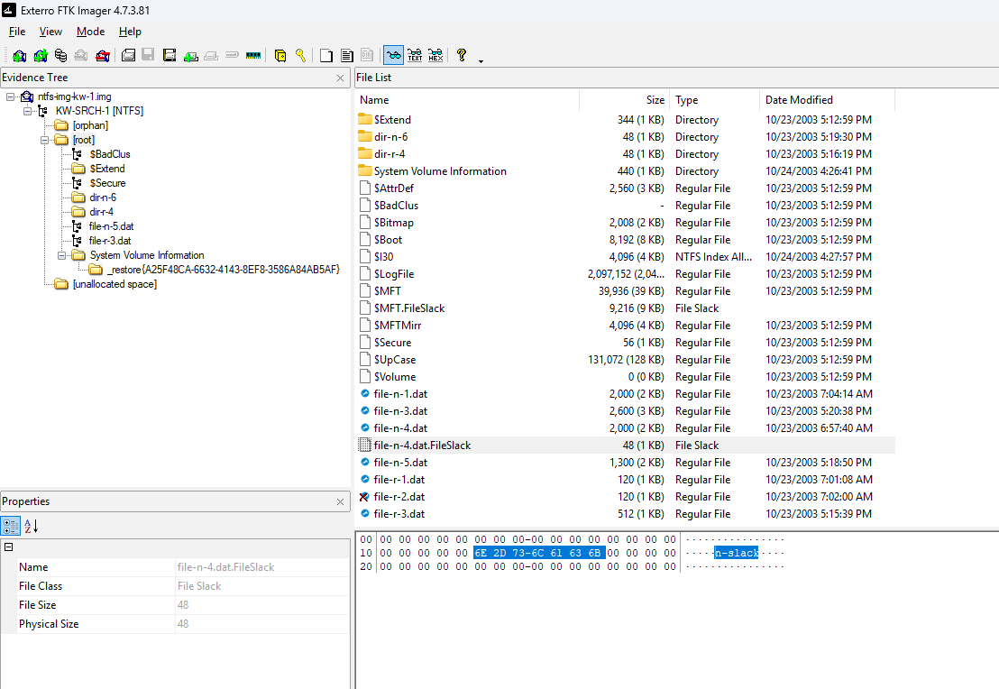

# NTFS-Keyword-Search-Validation-Using-FTK-Imager
NTFS forensic analysis using FTK Imager to identify artifacts across MFT, $LogFile, ADS, and slack space.

Project Overview

This project focuses on performing digital forensic analysis of an NTFS disk image using FTK Imager. The objective was to identify and validate keyword artifacts across multiple NTFS storage structures, including active, deleted, and hidden data locations. The analysis demonstrates how evidence can persist beyond standard file system views and highlights the importance of examining underlying file system components during investigations.

Tools Used:

FTK Imager

Key Findings:

Identified resident data stored within the $MFT, confirming how small files are contained within file records
Recovered deleted artifacts from the $LogFile, demonstrating persistence of historical file activity
Discovered hidden data within Alternate Data Streams (ADS) attached to both files and directories
Analyzed non-resident file storage, showing how larger files are stored in external disk clusters
Recovered residual data from file slack, highlighting how remnants of previous data persist beyond file boundaries

### Figure 1: NTFS Image Loaded in FTK Imager

The NTFS image was successfully loaded into FTK Imager, revealing key file system structures including $MFT and $LogFile.

---

### Figure 2: Resident Data Identified in $MFT (r-alloc)

The keyword 'r-alloc' was identified within the $MFT, confirming the presence of resident data stored directly within the file record.

---

### Figure 3: Deleted Artifact Identified in $LogFile (r-unalloc)

The keyword 'r-unalloc' was located within the $LogFile, demonstrating persistence of deleted file activity within NTFS transaction logs.

---

### Figure 4: Alternate Data Stream in File (r-fads)

The keyword 'r-fads' was identified within an alternate data stream attached to a file, highlighting hidden data storage within NTFS.

---

### Figure 5: Alternate Data Stream in Directory (r-dads)

The keyword 'r-dads' was identified within a directory-based alternate data stream, demonstrating a lesser-known method of concealed data storage.

---

### Figure 6: Non-Resident File Data (n-alloc)

The keyword 'n-alloc' was found in a non-resident file, indicating storage in external disk clusters rather than the MFT.

---

### Figure 7: Residual Data in File Slack (n-slack)

The keyword 'n-slack' was identified within file slack space, showing how residual data persists beyond file boundaries.

Conclusion

This analysis demonstrated that keyword artifacts are distributed across multiple NTFS storage structures, including resident MFT entries, non-resident clusters, alternate data streams, and slack space.

The findings highlight the importance of examining hidden and residual data sources, as critical evidence may exist outside standard file system views.
